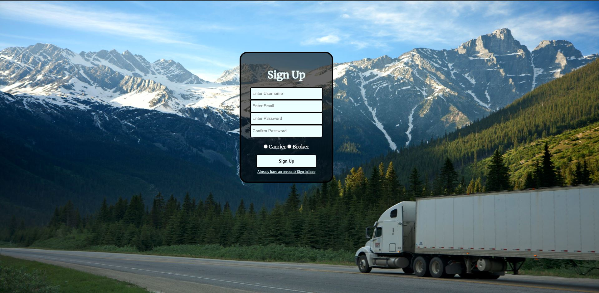

# CodeJam12 Team Penguins
## Team Members
- Chen, Long Kun
- Hu, Zi Chen
- Kang, Adriel Alberto

## Pain Points
We decided to tackle two pain points, one for the carriers, and one for the shippers. We realized that both had a similar problem: the lack of information from the other party. In fact, carriers often want the shippers to display their rates so that it is easier for them to choose a job that pays better. On the other hand, shippers often want to have access to the carrier's location so that they can have instant updates on the location of the carrier, and whether the job is completed or not.

## Our Solution
We want to provide a web application that would be exclusive to shippers that display their prices when creating jobs, and for carriers that give access to their location when doing a job. Since the two parties provide that extra information to the other, we want them to have to privilege of also having more information for a job. This solution does not enforce the enabling of location for carriers, nor does it enforce the display of a price for shippers, but it gives an interesting benefit for those that decide to do it. Our idea is to motivate and cheer up people so that they can share more information to the other parties.

## Implementation
Our solution is a web application that allows clients to create a shipper or carrier account, and to display their rates for each job or enable their location, respectively. This way, both parties will provide more information, but will also have access to more information.

### Front-End
The web application's UI is built using HTML and CSS files, as well as some JavaScript to interact with the user.

The front-end first redirects the user towards the login page, where they have the option to signup (create a new account).

Then, shippers are redirected to their jobs page, where they can post new jobs, edit previous jobs or delete unselected jobs. In order to edit a job, it must not be chosen by a carrier. Furthermore, shippers dispose of the option to track the location of the carrier for ongoing jobs (jobs that have been accepted), which redirects them to a new page where they can see the location of the carrier (updated every 0.5 second).

Carriers are redirected to a browsing page, where they can view available jobs and select one to do. They can also go to their ongoing jobs to see which one they have already accepted (for instance, check when they should deliver tha load).

### Back-End
The user communicates with the web application thanks to JavaScript and NodeJS. Express is used to interact with the user and handle the user requests. These requests are then passed to the service layer, which communicates to the Mongo Database using mongoose.

## Schemas
There are two main schemas to represent the data: User and Job tables/collections.

### User Schema

| Attribute | Required | Unique |
| :-: | :-: | :-: |
| Username | Yes | Yes |
| Email | Yes | Yes |
| Password | Yes | No |
| Client Type | Yes | Yes |

- Username: Used for display
- Email: Used for login credentials
- Client Type: Shipper or Carrier

### Job Schema

| Attribute | Required | Unique |
| :-: | :-: | :-: |
| Shipper | Yes | No |
| Carrier | No | No |
| Posted Day | Yes | No |
| Expected Delivery Date | No | No |
| Pick-Up Point | Yes | No |
| Drop-Off Point | Yes | No |
| Rate | Yes | No |
| Cargo Weight | Yes | No |

- Shipper: Set to the job poster by default
- Carrier: Set to null to display an available job
- Posted Day: Initialized as timestamp
- Cargo Weight: Required, as carriers have a maximum capacity

Note that the posted date is not a value that the shipper can enter, as the value will be generated automatically my express and mongoose when creating the job posting (using `Date.now()` and `{timestamps: true}`).

## Location Tracking
When selecting an ongoing job, a shipper has the option to track the live location of the carrier.
By clicking on the tracking button, the shipper gets redirected to a new page that diplays an interactive map. The location of the carrier is then querried and updated every 0.5 second (half-second).

## npm Installs
- moment
- express
- uuid
- express-handlebars
- path
- nodemon (-D)
- mongoDB
- morgan
- ejs
- body-parser
